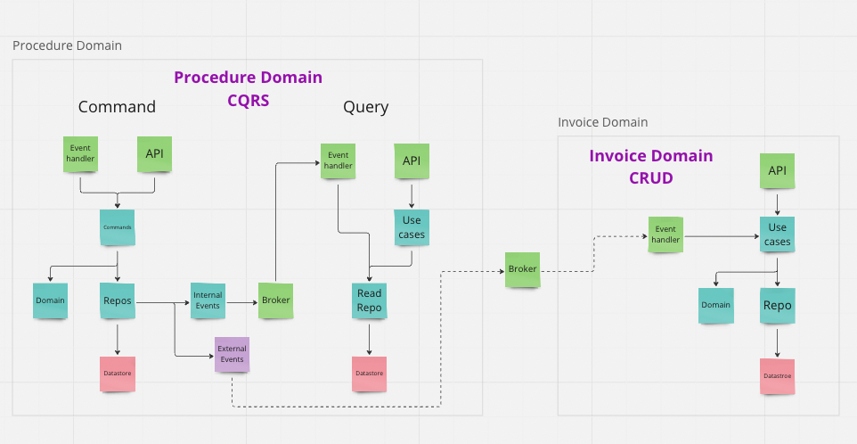

# Event Based Architecture - Docs WIP

## Intent
The intent of this project was to explore event based architecture specifically CQRS, event sourcing and event based state
transfer. Over time, it evolved into also exploring DDD concepts, testing boundaries and Spec by Example.

## Running the app
Everything is done from either the acceptance tests as I did not want to spin up actual services and APIs. For now just
run them via your IDE as there is no script to run them - will fix in future.

## Mock Service folder structure
Each folder in src is designed to be a service. They are almost completely decoupled from each other apart from a few types
and mocks that where reused out of laziness.  

## Idempotency
Idempotency is handled at the edges of the application using event IDs and storing them as they come in. This way we can
check if we have received the same one twice. I'm assuming the storing of events could be in temporary but investigation
has been pushed to the backlog for now.

Another strategy is to hash the event coming in which can give us certainty over the uniqueness of the event without
relying on the client to provide the event ID. It appears this can be deduced by the event itself along with timing
metadata however I'm yet to implement it.

## Default folder structure and responsibilities
#### externalInEvents - needs a better name
Observes events from other services \
Routes event to correct handler \
Checks the events for the correct structure \
Extracts useful event data then calls appropriate useCase

#### Service Layer command, query, useCases 
This is where we coordinate across different domain specific use cases - i.e. generate invoice from procedure. It is
split into three different folder across this application:
* commands and query when using CQRS
* useCases when using CRUD.

#### domain
Domain logic lives here \
Logic that will not change based on the context that it is used in (use case)

#### repo
Coordination of persisting the domain entities \
Fire external events \
Currently the db handles the internal events on save

### Data flow example

## Dependencies

## Testing Boundaries

## Storing domain representations vs fetching on use
The choice between storing a representation of a domain object within another domain vs fetching the data on use largely
depends on the rate in which the data changes in comparison to the consumer of the information.

Consider product information used on a procedure. It's very unlikely that updates are made to the product information often that
will be useful outside its own domain. A  product name is likely to be useful to other services such as procedures but
because the name may be updated >yearly we can save a lot of network calls by just storing the useful product information
within the procedure domain.

